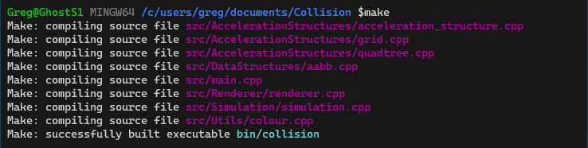
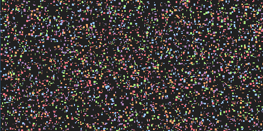

# Collision2D
A project demonstrating acceleration structures for 2D collision detection.

## Requirements
For Windows the recommended build environment is MSYS2 with MinGW. 
The required packages are:
- OpenGL
- GLFW

And build tools:
- make
- g++

These can be installed through MSYS2s package manager 'pacman' on Windows, or the distro's package manager on Linux.

## Building and running

Simply run make from the root directory and an executable will be created in a `bin` folder:

Then run the `bin/collision` executable with no arguments:

The executable displays some animated particles:

The particles move randomly but check for collisions with each other.

The camera can be moved using a mouse or arrow keys, and zoomed with a mousewheel.

## Arguments

`-h` - Display usage information

`-grid` - Runs using a 2D grid as an acceleration structure

`-quad` - Runs using a quadtree as an acceleration structure 

`-n <N>` - Specify the number of particles to create 
